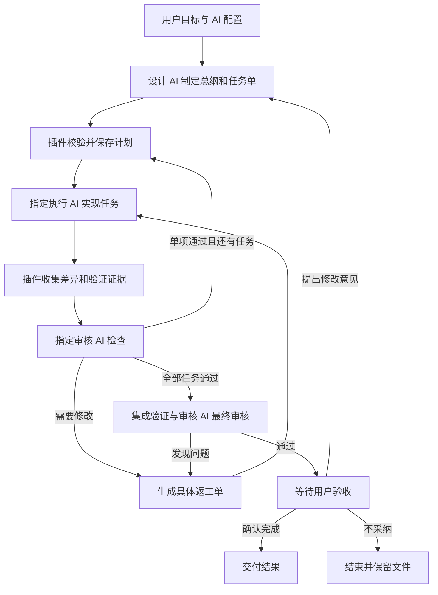

# Paseo Director 插件设计草案

目标：用户分别指定设计、执行和审核 AI。设计 AI 制定总纲，执行 AI 实现，审核 AI 检查成果并提出返工要求，最终交由用户验收。审核默认沿用设计会话，也支持独立选择模型。

本文保留总体设计与演进方向。用户已要求按方案实现；第一版现采用 Paseo 原生插件，针对本机 Paseo 0.8.0 实现并加载。实际使用、版本范围和第一版边界见 [README.md](./README.md)。设计、执行和审核 AI 均由用户自由安排。

工作区入口现默认在当前目录创建成果分支，所有协作会话绑定发起工作区；侧栏入口默认选择已有工作区，不额外创建侧栏条目。同目录禁止重叠运行，派发和采集成果前校验分支。两个入口均可主动选择独立 worktree；旧任务沿用原工作区。聊天中的交接协议用中文任务卡呈现，原文折叠保留，AI 接收的指令和结构化审核约束不变。

## 1. 用户体验

- 团队配置保存在当前 Paseo 主机，后续任务可复用。可在 Director 面板创建任务，也可在已有项目工作区的 Agent 输入框发送 `/director 任务描述`，使用当前目录和已保存团队下发并打开进度页。命令不带参数时只打开面板，不自动继承当前聊天历史或接管当前 Agent。Paseo 0.8 的「新建工作区」页面尚无工作区上下文，不加载插件命令；要直接创建协作任务，使用侧栏 Director 入口。
- 选择设计 AI 的供应商/执行工具及具体模型；若接入方式支持，也可将当前空闲会话绑定为设计 AI。可选项来自已接入且可用的 AI 配置。
- 指定执行 AI，可以设置一个默认执行者，也可以按前端、后端、测试等任务类型选择不同配置。
- 设计 AI 与执行 AI 分别配置，可以来自不同供应商，也可以使用同一家、同一模型的独立会话。第三步可沿用设计 AI 审核，也可指定独立审核配置；同一模型仍可创建独立审核会话。
- 输入目标、约束和验收要求，启动后在同一面板查看总纲、任务、实际使用的 AI 和审核记录。
- 总纲生成后默认自动执行；提供可选的“先看总纲”模式，在用户选择时才增加确认节点。
- 用户可以暂停、继续、取消、补充要求。修改进行中任务的要求会产生新版本，旧版本结果不得直接满足新要求。
- 完成时展示实际改动、验收证据、审核结论、尚未解决的问题；“完成”定义为本地成果通过验收，发布和合并属于另外的动作。

配置界面示意：

```text
任务：给项目增加登录功能
设计 AI：   [选择 AI 配置]
审核 AI：   [沿用设计 AI / 单独选择 AI 配置]
默认执行者： [选择 AI 配置]
按任务覆盖： 前端 [配置 A]  后端 [配置 B]
执行策略：   自动执行总纲
并发数：     1
最多返工：   2 次

[启动]

总纲 v1 → 执行 2/3 → 审核 AI 检查 → 用户验收 → 已完成
```

## 2. 职责与流程

| 角色 | 负责什么 | 交付物 |
| --- | --- | --- |
| 设计 AI | 理解需求、设计架构、拆任务、按用户配置分派与调整设计 | 总纲、任务单 |
| 审核 AI | 检查实际成果与验收证据，决定通过、返工或受阻 | 单项和最终审核结论 |
| 执行 AI | 按任务实现、验证、提交成果，遇到设计问题提出阻塞原因 | 代码、测试结果、变更说明 |
| 插件调度器 | 校验指令、启动与恢复会话、保存进度、收集证据、控制依赖和返工 | 可恢复的任务状态与历史 |



第一版允许多个执行 AI 配置，但同时仅有一个 AI 写入该任务工作区。审核 AI 在执行期间等待，在代码静止后审核。后续并行模式为各子任务创建独立 Git worktree，按依赖顺序汇入集成分支；最终审核必须针对合并后的成果重新进行。

## 3. 指定 AI 的规则

- 将“AI 配置”和“角色绑定”分开：配置描述接入工具/供应商、模型、推理选项和执行模式；角色绑定决定本次任务中谁做设计 AI、谁做审核 AI、谁做默认执行者、哪些任务使用其他执行者。保存此次运行的配置快照。
- 默认严格采用用户安排：具体任务指定优先于任务类型指定，再回落到默认执行者。仅在用户启用“允许设计 AI 挑选执行者”时，设计 AI 才能从指定列表挑选。
- 设计 AI 使用配置 ID 分派，例如 `frontend-worker`，不自行构造任意模型名称。
- 第一版由插件创建执行会话；返工尽量复用同一子会话，保留上下文。
- 指定 AI 不可用时进入阻塞状态，并解释原因。只有用户预先设置备用配置时才自动切换，记录实际使用的 AI。
- 未指定 `reviewerProfileId` 时，审核回到原 `directorAgentId`。显式指定时，单项与最终审核使用独立 `reviewerAgentId`，包括模型与设计者相同的情况。缺失审核会话只按审核配置重建，不回退到设计模型。新配置不修改已有任务快照。
- 一个运行只有一个调度器负责推进；同一 AI 会话同一时间只接收一个属于该运行的工作指令。

例如用户可以配置“设计 AI = 配置 A；前端执行 = 配置 B；后端执行 = 配置 C”，也可以下一次改为“设计 AI = 配置 B；全部执行 = 配置 A”。角色不绑定任何固定供应商。

用户主动更换执行者时，未开始任务采用新绑定；正在执行的任务先完成当前尝试或确认停止，再把任务单、已有成果和待解决问题交给新执行者。更换设计 AI 时同步设计总纲、关键决定和审核记录，不假设不同会话共享记忆。

## 4. 设计 AI 怎样调用执行 AI

插件通过 MCP 提供以下逻辑指令，兼容模式使用对应的结构化输出协议。

| 工具 | 角色与作用 |
| --- | --- |
| `submit_plan` | 设计 AI 提交结构化总纲和任务依赖 |
| `dispatch_task` | 设计 AI 为任务选择允许的执行配置并入队，立即返回任务 ID |
| `get_run_status` | 各角色查询当前任务状态 |
| `submit_review` | 审核 AI 提交通过、返工或受阻决定，绑定成果版本；沿用设计会话时由设计者调用 |
| `submit_result` | 执行 AI 提交实现和验证结果 |

执行 AI 通过 `submit_result` 提交待审成果或阻塞原因。调度器校验指令来源的角色、任务归属、配置选择和状态；设计 AI 的输出不能覆盖用户已确定的角色绑定。

整体分为四层：角色配置、工作流调度、AI 接入适配、状态与成果存储。调度层只使用创建会话、发送任务、读取状态、收集成果、停止执行等统一能力，具体由 Paseo SDK、工具调用或其他后续选定的方式实现。

`dispatch_task` 只负责可靠入队，后台执行器通过接入适配层创建子会话，记录其与总会话的关联。设计 AI 提交分派后结束当前轮次；完成条件满足后，调度器向选定的审核会话发送一次请求。如果审核 AI 仍在处理用户消息，审核请求排队。

候选交接方式包括 MCP 工具调用和经 schema 校验的结构化输出；根据最终接入方式及各 AI 的能力选择。两种方式共用任务协议和状态机，普通对话里的“完成了”不能直接触发完成状态。

## 5. 结构化交接

| 数据 | 必须保存的内容 |
| --- | --- |
| Run | 用户需求、配置快照、总会话 ID、工作区、状态、计划版本、运行限制 |
| Plan | 目标、范围、架构决定、接口约定、验收标准、任务依赖 |
| Task | 任务 ID、计划版本、执行配置、可修改范围、输入、验收项、前置任务 |
| Attempt | 尝试 ID、子会话 ID、工作区、起止时间、基础版本、交付版本、执行状态 |
| Result | 修改清单、成果引用、测试命令及退出码和日志、已知问题 |
| Review | 审核的成果版本、逐项验收证据、决定、问题位置、修改要求、复验方法 |

每个子任务接收相关总纲、共享接口、当前任务要求和依赖成果，避免重复传递全部聊天记录。设计调整产生新 Plan 版本，并显式使受影响的下游任务或审核失效。

所有 AI 输出通过 schema 校验。格式不符触发有次数限制的补交；缺少证据不得转换为通过状态。

## 6. 审核与完成条件

执行者提交结果后，插件确认其当前轮次已结束，保存可重复读取的成果版本，再请求审核。Git 项目使用 base/head commit 与未提交改动快照标识成果，避免审核对象在过程中变化。

审核 AI 收到原验收标准、实际 diff、测试日志和执行说明，并可以直接读取成果工作区。执行 AI 自述的完成情况只是审核输入。

- `approved`：列出每项验收标准及对应证据。
- `changes_requested`：列出任务 ID、问题位置、原因、具体修改要求和复验方法。
- `blocked`：说明缺少的信息、权限或环境条件。

默认由审核 AI 读取实际成果、自行选择验证方式并作出审核决定，用户只需安排设计、执行和审核角色，无需预先填写测试命令。插件始终保存成果快照并检查逐项审核依据。用户可选地指定额外检查命令，插件运行这些命令并保存原始结果；已指定检查失败时不得由 AI 的通过结论覆盖。未指定检查不标记为测试通过。全部子任务通过后，还需由选定的审核 AI 检查最终集成版本；成果版本改变时，相应验收失效。

默认每个任务允许首次执行后最多 2 次返工，并对每轮运行设置总尝试次数和时间上限，防止 AI 通过新增任务绕过限制。达到上限进入 `needs_attention`，保留成果和问题，不继续无限循环。只有用户在最终验收后主动提交修改意见才能开启新的有界预算；等待最终用户验收不会触发超时。

## 7. 状态与恢复

主流程状态：`planning → executing → reviewing → final_review → awaiting_acceptance → completed`。控制状态有 `running`、`paused`、`waiting_permission`、`needs_attention`、`canceling`、`canceled`。

AI 最终审核通过只进入等待用户验收；用户确认后才完成。用户可不采纳并结束（保留代码），也可提交修改意见，由原设计 AI 重新安排必要修改、执行 AI 实现、原审核 AI 复审，之后再次进入用户验收。修改轮保留原目标、原成果、旧总纲及审核证据；总纲确认设置继续生效。验收动作绑定成果版本和持久化记录版本，重复或过期提交不能应用到新一轮。旧版 AI 审核后直接完成的记录仍可主动验收或追加意见；重开前必须检查成果分支和同目录其他未完成任务。

状态必须持久化，AI 工作目录不作为运行状态的唯一存储。关键记录包括任务、尝试、待发送指令、待处理审核和追加历史。若最终选择本地后台进程，可使用 SQLite；存储位置和实现随接入方案确定。

- 先保存待发送指令，再调用接入适配层；副作用结果回写状态。
- 指令有稳定 ID，推进状态使用事务及版本检查；重复完成事件只能触发一次审核。
- 创建子会话时附加运行、任务、尝试标签。重启后先查询现存会话并对账，避免重复启动。
- 创建或发送结果不明确时先读取会话与时间线；不能证明是否执行过的修改任务进入待核对状态，不盲目重发。
- 事件只是唤醒信号。启动时及运行期间周期性核对数据库、会话和成果，补偿丢失通知。
- 第一版使用单调度器进程和运行锁。异步回调不能同时推进同一任务。
- SDK 的等待超时表示等待结束，不表示 AI 已停止。到达任务期限后先请求停止并确认状态，再决定重试。
- 权限等待单独呈现，保留 Paseo 原权限流程；不能当作执行失败反复创建新 AI。
- 暂停停止派发，当前尝试默认运行至检查点；取消显式停止关联执行，并核对停止结果。
- 客户端关闭后，只要执行环境和调度后台继续运行，任务继续推进；后台重启后执行恢复对账。

## 8. 接入方式与演进候选

第一版已采用“Paseo 原生插件 + 插件后台调度器 + 官方 SDK”，并针对本机 Paseo 0.8.0 完成接口核对。以下独立服务和源码修改方案仍是后续演进候选。

原生插件负责 AI 角色选择、任务入口和进度面板；调度器在 daemon 主机的插件后端运行，通过 SDK 创建用户指定的 AI 会话、收集成果并唤醒指定审核 AI。任务与审核状态持久化到本地存储。将工作流引擎写成独立 TypeScript 模块，通过小范围适配层调用 Paseo，便于测试和应对版本变化；第一版仍随插件一起运行，无需另外部署一个常驻服务。

MCP 按角色暴露工具：设计者提交计划和入队任务，独立审核者仅提交审核，执行者仅提交结果。沿用设计会话审核时保留原设计者的审核工具。审核 actor 使用任务 ID 不可能包含的命名空间，防止与历史任务 ID 冲突。仅对验证支持该能力的 AI 配置启用；其他配置可通过结构化输出适配相同协议。MCP 是指令入口，官方 SDK 承担实际会话管理，两者职责不同。

推荐理由：用户能在现有 Paseo 工作区安排角色并观察结果；会话管理复用 Paseo；首次安装只维护一个插件；核心工作流模块仍可在未来迁出。主要代价是插件 API 的版本适配，以及插件后端重载后必须恢复任务。手机断开不应停止后台调度，但 daemon 或插件后端停止时，自动派发与回审暂停，恢复后先核对已有会话状态。

只有在后续需要跨多个 daemon 调度，或要求调度器独立于插件重载持续运行时，才建议将工作流引擎移到独立服务。修改 Paseo 源码留给已证实公开接口无法满足的需求。

方案比较：

| 候选 | 形态 | 需要评估 |
| --- | --- | --- |
| Paseo 原生插件 | 界面和后台能力接入 Paseo 插件机制 | 用户版本对应的 API 与后台生命周期 |
| 独立编排服务 | 独立进程通过 Paseo SDK 管理会话 | 进程启动、任务入口、状态展示与连接恢复 |
| 修改 Paseo 源码 | 将工作流融入现有产品 | 上游升级维护成本和需要修改的范围 |

MCP 属于 AI 与调度器之间的可选指令传递方式，可与上述不同部署形态组合，并不是必须采用的插件格式。

可行性调研记录：截至查阅时，官方文档标注 v0.7 为稳定版本、v0.8 为 beta，插件 API 仍属实验性。若选择原生插件，需匹配用户的 daemon 和 app 版本。v0.8 的生命周期 hook 超时为 30 秒，事件尽力投递，不保证重放或回调完成顺序，适合作为调度唤醒信号。其他接入可评估 SDK 状态订阅和查询；无论哪种方式，持久化与状态对账都是核心要求。

任务面板和时间线展示数据库状态的投影，不能只靠聊天行保存进度。工作区和 worktree 解决代码组织和并发修改问题，不等价于进程安全沙箱；执行权限使用各 provider 实际支持的能力。

## 9. 第一版范围与验收

第一版完成以下闭环：可配置设计者、执行者和独立审核者、串行子任务、结构化任务单、按配置回到审核会话、最多 2 次返工、状态面板、暂停取消、重启恢复。并行任务、复杂分支自动合并和多重审核投票在后续增加。

验收应覆盖：

1. 设计 AI 生成总纲后，实际启动的是用户指定的 provider/model。
2. 执行者交付后，指定的审核 AI 自动收到对应成果版本的审核请求；未指定时沿用原设计会话。
3. 审核不通过时，原执行会话收到具体返工单，超过次数上限停止。
4. 执行者说完成但验证失败时，运行不能进入完成状态。
5. 重复事件不会创建重复任务，丢失事件能由状态核对恢复。
6. 在创建会话前后、发送指令前后重启，不会盲目重跑代码修改。
7. 手机断线不影响后台推进；权限等待和超时不会被误判为成功。
8. 用户暂停、取消或修改需求后，迟到结果不能继续推进旧流程。
9. 设计、执行和审核 AI 可以互换供应商配置，也能使用同一供应商的独立会话；具体任务指定覆盖默认执行者，未经用户允许不会自动改派。

## 官方依据

- [插件版本说明](https://paseo.sh/docs/plugins)：v0.7 / v0.8 文档与版本差异。
- [v0.8 插件参考](https://paseo.sh/docs/plugins/v0.8/reference)：客户端和服务端入口、面板、RPC、生命周期 hooks 与事件限制。
- [v0.7 插件参考](https://paseo.sh/docs/plugins/v0.7/reference)：旧版入口与运行机制。
- [Agent SDK](https://paseo.sh/docs/sdk/agents)：父子会话、继续既有会话、结构化输出和等待状态。
- [Provider SDK](https://paseo.sh/docs/sdk/providers)：动态发现模型、配置会话及 MCP 服务。
- [Workspace SDK](https://paseo.sh/docs/sdk/workspaces)：复用目录与创建隔离 worktree。
- [Paseo MCP](https://paseo.sh/docs/mcp)：已有 agent 和 workspace 工具以及 provider 工具配置。

以上资料支撑接入能力；任务协议、调度器、数据模型、界面及恢复策略是本插件拟实现的设计。
